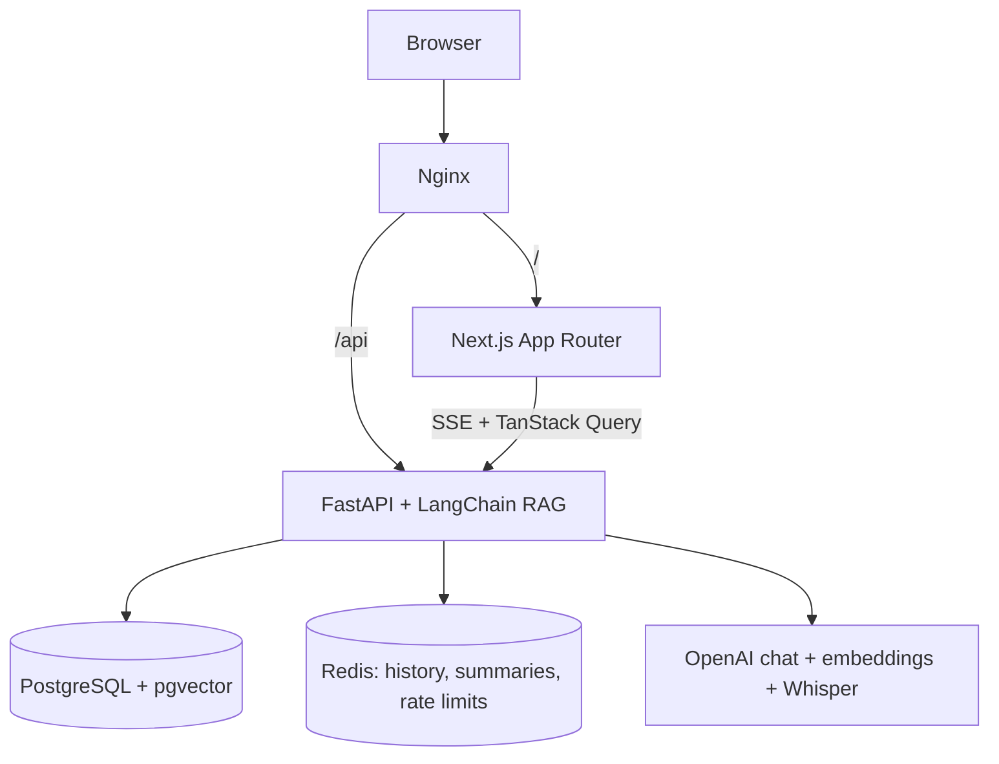

# PanScience

Full-stack RAG platform for asking questions over PDFs, audio, and video — with page citations and timestamp-aware media seek.

## Problem

Research and ops teams bury answers in long PDFs and lecture recordings. Generic chatbots lack grounded citations; media players do not jump to the segment that answered the question. PanScience ingests documents and media, embeds chunks into Postgres/pgvector, and streams grounded answers with citations the UI can act on.

## Features

- PDF Q&A with page-level citations (PyMuPDF ingestion)
- Audio/video transcription via Whisper (verbose segments) and ~30s chunking with start/end times
- Semantic retrieval with pgvector cosine similarity (IVFFlat)
- Token streaming answers over SSE
- Map-reduce document summaries cached in Redis
- JWT auth for multi-user isolation
- Redis-backed chat rate limiting (configurable per-minute budget)
- Large media split with ffmpeg before Whisper’s size limit; timestamps offset-corrected on merge
- Docker Compose stack: Nginx, FastAPI, Next.js, Postgres, Redis
- Backend pytest suite with `--cov-fail-under=95`; frontend Jest tests

## Architecture



### Ingestion and retrieval

1. Upload → file processor extracts text (PDF) or transcribes media (Whisper `verbose_json` + segment timestamps).
2. Chunks stored with embeddings (`text-embedding-3-small` by default) and optional `page_num` / `start_time` / `end_time`.
3. Chat retrieves top-k chunks, streams tokens via LangChain callback → SSE, then emits citation payloads the frontend uses for seek/highlight.

## Tech stack

| Layer | Choice |
|---|---|
| API | FastAPI, SQLAlchemy async, Alembic, Pydantic |
| RAG | LangChain, OpenAI chat/embeddings, Whisper |
| DB | PostgreSQL + pgvector |
| Cache / limits | Redis, SlowAPI |
| Frontend | Next.js 14, React 18, Zustand, TanStack Query, react-player |
| Edge | Nginx reverse proxy |
| Ops | Docker Compose, GitHub Actions CI |

## Key engineering decisions

1. **Timestamps as first-class citations.** Segment times live on chunks; the UI seeks via Zustand events rather than coupling chat bubbles to the player.
2. **Single Postgres for vectors.** pgvector keeps ops simple versus a separate vector DB for this scale.
3. **Dependency-injected FastAPI services.** Tests override I/O (OpenAI, Redis, Whisper) with `AsyncMock`; unit tests can use SQLite; CI integration uses real Postgres.
4. **Redis triple-duty.** Short chat history TTL, summary cache, and distributed rate limits.
5. **Coverage gate.** Backend pytest enforces ≥95% line coverage on `app/`.

## Getting started

### Prerequisites

- Docker and Docker Compose
- `OPENAI_API_KEY`

### Run

```bash
git clone https://github.com/darkNIGHT669/Panscience.git
cd Panscience
cp .env.example .env
# set OPENAI_API_KEY and a strong SECRET_KEY
docker compose up --build
```

| Service | URL |
|---|---|
| Web app | http://localhost |
| OpenAPI | http://localhost/api/docs |

Register via the UI, then upload a document and open a chat session.

### Environment variables (names)

| Variable | Required | Notes |
|---|---|---|
| `OPENAI_API_KEY` | yes | Chat, embeddings, Whisper |
| `SECRET_KEY` | yes | JWT signing (32+ chars) |
| `DATABASE_URL` | compose default | Async SQLAlchemy URL |
| `REDIS_URL` | compose default | Cache + rate limits |
| `OPENAI_CHAT_MODEL` | no | default `gpt-4o` |
| `OPENAI_EMBEDDING_MODEL` | no | default `text-embedding-3-small` |
| `MAX_FILE_SIZE_MB` | no | default `500` |
| `RATE_LIMIT_PER_MINUTE` | no | default `20` |
| `TOP_K_RETRIEVAL` | no | default `5` |

### Tests

```bash
cd backend && pip install -r requirements.txt && pytest
cd ../frontend && npm install && npm test
```

## Project structure

```
Panscience/
├── backend/app/
│   ├── api/           # auth, documents, chat routes
│   ├── core/          # config, security
│   ├── db/            # models
│   ├── services/      # file_processor, transcription, embeddings, rag, summarizer, cache
│   └── schemas/
├── backend/tests/
├── frontend/src/      # App Router, components, hooks, store
├── nginx/nginx.conf
├── docker-compose.yml
└── .github/workflows/ci.yml
```

## Deployment notes

Compose is the primary local/prod-like path. Point Nginx upstreams at your hosts, set production `SECRET_KEY` / `OPENAI_API_KEY`, and run Alembic migrations on boot (compose already wires this for the backend image). See `.github/workflows/ci.yml` for CI expectations.

## License

MIT (as stated in the prior project materials for PanScience Innovations). Confirm `LICENSE` file presence in your fork before redistributing.
